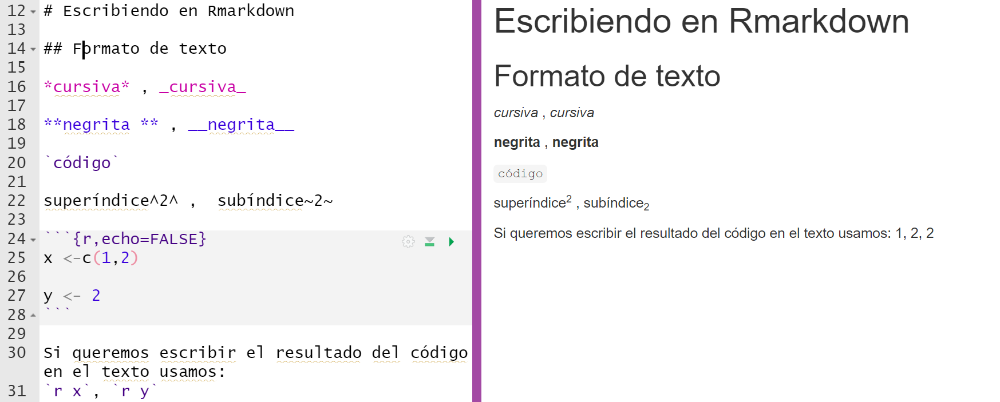

```{r setup, include=FALSE}
knitr::opts_chunk$set(echo = FALSE)
library(here)
```

## [¿Qué es R Markdown?]{style="color:#88398A"}

1)  Lenguaje de programación que integra:

    -   código

    -   resultados

    -   comentarios en prosa

2)  Los documentos de R Markdown son completamente reproducibles y soportan docenas de formatos de salida

<center>
```{r, echo=FALSE}
   knitr::include_graphics(here("imagenes",'figura1.png'))
```
</center>


Rmarkdown permite generar informes, presentaciones, páginas web, tesis y libros, entre otros.

## [¿Para qué Sirve?]{style="color:#88398A"}

Los archivos R Markdown están diseñados para ser usados de tres maneras:

1.  Para comunicarse con quienes toman decisiones, que desean enfocarse en las conclusiones, no en el código que subyace al análisis.

2.  Para colaborar con otras personas que hacen ciencia de datos (¡incluyendo a tu yo futuro!), quienes están interesados tanto en tus conclusiones como en el modo en el que llegaste a ellas (es decir, el código).

3.  Como un ambiente en el cual hacer ciencia de datos, como si fuera un notebook de laboratorio moderno donde puedes capturar no solo que hiciste, sino también lo que estabas pensando cuando lo hacías.

## [¿Cómo funciona Rmd?]{style="color:#88398A"}

Flujo de trabajo:

```{r, echo=FALSE}
   knitr::include_graphics(here("imagenes",'figura2.png'))
```

<font size="3">

1. Crear el archivo de Rmarkdown. Escribir del texto y los bloques de código

2. Cuando hacemos Knit R Markdown envía el .Rmd a knitr (<http://yihui.name/knitr/>) que ejecuta todos los bloques de código.

3.  y crea un nuevo documento markdown (.md) que incluye el código y su output

4.  El archivo markdown generado por knitr es procesado por pandoc (<http://pandoc.org/> conversor universal de archivos) que es el responsable de crear el archivo terminado.

5.  Obtenemos un archivo con el formato de salida pedido.

Nota: Debido a la creación de archivos intermedios es importante manejarse con un mismo directorio, asi que te proponemos crear un proyecto.

</font>

## [Componentes de un documento de RMarkdown]{style="color:#88398A"}

```{r, echo=FALSE}
   knitr::include_graphics(here("imagenes",'figura3.png'))
```

## [Formateo de texto con Markdown]{style="color:#88398A"}

<center>

{width=110%}

</center>

## [Listas y otros]{style="color:#88398A"}

<center>

{width=100%}

</center>

## [¿Qué es un chunk?]{style="color:#88398A"}

* Son porciones de código R que R Markdown va a ejecutar e incluir los resultados en el ambiente de R.

* Si tienen una salida explícita (por ej, tabla, gráfico) estos resultados pueden incluirse o no en el documento final.

Hay tres maneras de crear un chunk:

1. Con el atajo de teclado: `Cmd/Ctrl + Alt + I`

<center>

{width=90%}
</center>

## [Opciones]{style="color:#88398A"}

La salida de los bloques puede personalizarse con options, son argumentos suministrados en el encabezado del bloque. Para más información ver [opciones para el bloque](http://yihui.name/knitr/options/).

<font size="3">

* eval = FALSE impide que se evalúe el código. Ayuda a depurar errores.
* include = FALSE ejecuta el código, pero no muestra el código o los resultados en el documento final. 
* echo = FALSE no aparece el código, pero muestra los resultados en el informe final. Típico para uso con gráfico donde querés el output y no el código que lo creó.
* message = FALSE o warning = FALSE impide que mensajes o advertencias aparezcan en el archivo final.
* results = 'hide' oculta la salida de R que algunas funciones de R tienen habitualmente en la consola de R.
* fig.show = 'hide' esconde los gráficos.
* error = TRUE hace que el tejido/compilación de texto y código (render en inglés) continúe aunque el código devuelva un error. Ayuda a detectar dónde hay un error. Avisa del error pero continua hasta el final.

</font> 

## [Encabezado YAML]{style="color:#88398A"}

Es posible controlar otras configuraciones de “documento completo” haciendo ajustes a los parámetros del encabezado YAML.
YAML: es la sigla en inglés de la frase **“yet another markup language”**, que significa “otro lenguaje de marcado más”. 

Este lenguaje de marcado está diseñado para representar datos jerárquicos de modo tal que sea fácil de escribir y leer para humanos. R Markdown lo utiliza para controlar muchos detalles del output.

## [Parámetros]{style="color:#88398A"}

Los documentos R Markdown pueden incluir uno o mas parámetros cuyos valores pueden ser fijados cuando se renderiza el reporte. Los parámetros son útiles cuando quieres re-renderizar el mismo reporte con valores distintos para varios inputs clave.

<center>

{width=50%}

</center>

## [¿Dónde buscar más información?]{style="color:#88398A"}

* Capítulos 26 - 30 de "R for Data Science" (Grolemund & Wickham, 2017). Acceso gratuito en <http://r4ds.had.co.nz>.

* En inglés y de los creadores de Rmarkdown: 
<https://bookdown.org/yihui/rmarkdown/>


* Libros escritos utilizando Rmarkdown:
<https://bookdown.org/>


<center>

{width=50%}

</center>

## [Ahora a trabajar!]{style="color:#88398A"}
